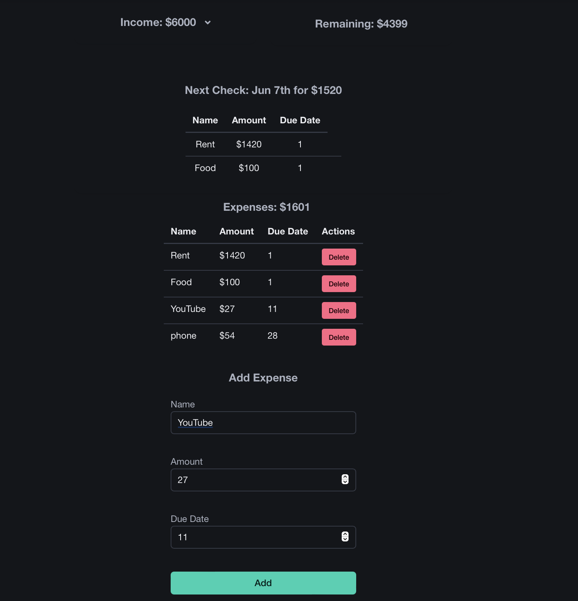

# Wise Wallet Win APP

> Wise Wallet Win helps you plan each paycheck confidently by predicting upcoming expenses, so you can allocate funds smarter and avoid financial surprises.

## Table of Contents

- [Application Overview](#application-overview)
  - [Screenshot](#screenshot)
  - [Video](#video)
- [Features](#features)
- [Technologies Used](#technologies-used)
  - [Backend](#backend)
  - [Frontend](#frontend)
  - [Containerization and Deployment](#containerization-and-deployment)
- [Usage](#usage)
- [Changelog](CHANGELOG.md)
- [Contribution Guidelines](#contribution-guidelines)
- [License](#license)
- [Acknowledgements](#acknowledgements)
- [Author](#author)

## Application Overview

Wise Wallet Win empowers users to take control of their finances by planning their next paycheck with confidence. By predicting upcoming expenses before payday, users can easily allocate income toward bills, savings, and other priorities. Turn your paycheck into a tool for smarter financial control—without the hassle of spreadsheets.

### Screenshot

### Video

[Link to Video](./images/video.mov)

## Features

- **Expense Tracking**: Full CRUD functionality for managing expenses.
- **Income Management**: Track income, allocate funds, and plan ahead.
- **Mobile-Friendly UI**: Responsive interface designed with React Bootstrap and Bulma CSS for an optimal user experience.
- **Real-Time Data Sync**: Changes are reflected immediately, ensuring users always have up-to-date financial information.
- **Secure Authentication**: Secure login and user management via JWT and OAuth2.
  
## Technologies Used

### Backend

- **FastAPI with Beanie ORM**: Now uses Beanie ORM and MongoDB Atlas for a robust NoSQL database solution.
- **MongoDB Atlas**: Provides scalability and high availability.
- **JWT and OAuth2 Authentication**: Secures user authentication and data privacy.

### Frontend

- **Vite**: Replaced Create React App for faster builds and improved performance.
- **React Bootstrap & Bulma CSS**: Used for UI components and styling.
- **Axios**: Handles API communication between the frontend and backend.

### Containerization and Deployment

- **Docker Hub**: Backend containers are stored in Docker Hub for consistent distribution.
- **AWS EC2 with GitHub Actions**: Backend is deployed on AWS EC2 with a self-hosted GitHub Actions runner, ensuring smooth deployment of new updates.
- **AWS S3 & CloudFront**: Frontend static files are hosted on an S3 bucket and cached using CloudFront for fast and secure content delivery.
- **SSL with AWS ACM**: Ensures HTTPS is enabled for secure communication.

## Usage

Visit the application at [Wise Wallet Win](https://wisewalletwin.com) to create an account, track your finances, and start managing your expenses.

## Changelog

See the full [Changelog](CHANGELOG.md) for version history.

## Contribution Guidelines

We welcome contributions from the community. Please check out the [Contribution Guidelines](CONTRIBUTING.md) for more details.

## License

This project is licensed under the MIT License.

## Acknowledgements

Thanks to the open-source community for providing invaluable resources and tools.

## Author

Dhayv

Wise Wallet Win is not just an application; it's a step towards financial empowerment. Check it out and take control of your finances today!
